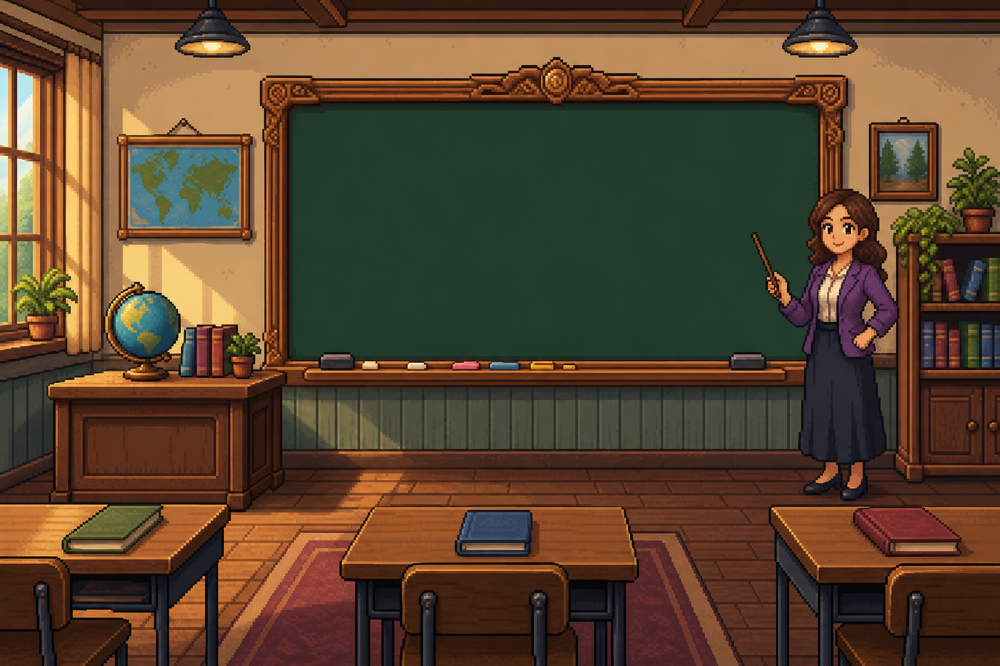
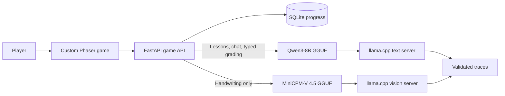
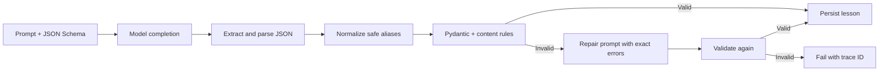

<div align="center">

# Secret Student

### A Pokemon-inspired AI school game built for a niece who loves games and hates school

[](https://huggingface.co/build-small-hackathon)
[](https://huggingface.co/build-small-hackathon)
[](https://huggingface.co/spaces/asanwari/secret-student)
[](https://github.com/asanwari/secret-student)
[](https://github.com/ggml-org/llama.cpp)

**Learn at school. Get briefed by Grandma. Defeat a villain with what you learned.**

</div>

Secret Student turns an AI-generated lesson into a retro 2D mission. The player
is a student by day and a secret agent after class. Lessons become intelligence,
quizzes become training, and the final assessment becomes a boss battle.

The whole AI stack can run locally through two small GGUF models and llama.cpp.
There is no required cloud model API, and the custom Phaser interface looks and
plays like a game rather than a default chatbot.

## Hackathon Submission

Secret Student is submitted to **both** [Build Small](https://huggingface.co/build-small-hackathon)
tracks. The required organization submission is
**[build-small-hackathon/secret-student](https://huggingface.co/spaces/build-small-hackathon/secret-student)**.

> [!IMPORTANT]
> The organization Space cannot currently provision GPU hardware, so the live
> submission runs the game in a CPU-hosted Space and serves the current text and
> vision models through a routed Modal GPU deployment. This is a hosting
> workaround, not a model-size requirement: the same source can run both models
> in one local llama.cpp deployment when GPU hardware is available.

## Team

- [asanwari](https://huggingface.co/asanwari)

## Judges: Inference and GPU Setup

> [!CAUTION]
> **Please read this before evaluating latency.** The current submission calls a
> Modal-hosted llama.cpp deployment because the organization Space cannot
> provision a GPU. Modal scales down when idle, so the first lesson or
> handwritten-answer check after an idle period can be **significantly slower
> while the GPU starts and the GGUF models load**. This is cold-start latency,
> not the normal warm inference path.

The current model pair uses about **13 GB of VRAM** when loaded together. It can
run on one GPU with at least 16 GB of VRAM, including:

- NVIDIA GeForce RTX 4060 Ti 16 GB
- NVIDIA GeForce RTX 4070 Ti SUPER 16 GB
- NVIDIA GeForce RTX 4080 / 4080 SUPER 16 GB
- NVIDIA GeForce RTX 3090 or RTX 4090 24 GB
- AMD Radeon RX 7800 XT or 7900 GRE 16 GB
- AMD Radeon RX 7900 XT 20 GB or 7900 XTX 24 GB

### LLM Runtime Options

`LLM_RUNTIME` selects the inference topology:

```text
mock                     deterministic local content with no model server
external                 OpenAI-compatible external routes, including Modal
embedded_llamacpp        one llama.cpp server beside the app
embedded_dual_llamacpp   separate local text and vision llama.cpp servers
```

The submission currently uses `external`. The fully local GPU path is
`embedded_dual_llamacpp`.

### How to Test Completely Locally

The Docker image already includes CUDA-enabled llama.cpp, and `app.runtime`
already knows how to launch and health-check separate text and vision servers.
No code changes or additional inference service are required.

1. Run on a machine, Docker host, or Space with a suitable GPU.
2. In `.env` or **Settings -> Variables and secrets**, replace the external
   runtime configuration with the values below.
3. Restart the app. On the first boot, allow time for the model downloads unless
   the GGUF files have already been placed in persistent `/data/models` storage.

**Variables:**

```text
LLM_RUNTIME=embedded_dual_llamacpp
LLM_PROVIDER=openai_compatible

LLM_MODEL=Qwen/Qwen3-8B-GGUF:Q4_K_M
LLAMA_CPP_MODEL_REF=Qwen/Qwen3-8B-GGUF:Q4_K_M
LLAMA_CPP_CTX_SIZE=8192
LLAMA_CPP_GPU_LAYERS=999
LLAMA_CPP_THREADS=8
LLAMA_CPP_PARALLEL=1
LLAMA_CPP_STARTUP_TIMEOUT=900

VISION_LLM_MODEL=openbmb/MiniCPM-V-4_5-gguf:Q4_K_M
VISION_LLAMA_CPP_MODEL_REF=openbmb/MiniCPM-V-4_5-gguf:Q4_K_M
VISION_LLAMA_CPP_CTX_SIZE=4096
VISION_LLAMA_CPP_GPU_LAYERS=999
VISION_LLAMA_CPP_PORT=8002
```

If the runtime does not have preloaded model files, **delete**
`LLAMA_CPP_MODEL_PATH`, `VISION_LLAMA_CPP_MODEL_PATH`, and
`VISION_LLAMA_CPP_MMPROJ_PATH`. Their absence tells llama.cpp to download the
configured GGUF repositories. For faster restarts with persistent storage,
preload the files and set:

```text
LLAMA_CPP_MODEL_PATH=/data/models/qwen3-8b/Qwen3-8B-Q4_K_M.gguf
VISION_LLAMA_CPP_MODEL_PATH=/data/models/minicpm-v-4_5/MiniCPM-V-4_5-Q4_K_M.gguf
VISION_LLAMA_CPP_MMPROJ_PATH=/data/models/minicpm-v-4_5/mmproj-model-f16.gguf
```

`LLM_BASE_URL`, `VISION_LLM_BASE_URL`, `LLM_API_KEY`, and
`VISION_LLM_API_KEY` belong to the current Modal configuration. They are ignored
by `embedded_dual_llamacpp` and may be removed when switching to fully local
inference.

### Configurability Built Into the Project

| Area | Configuration |
| --- | --- |
| Inference topology | `mock`, external OpenAI-compatible routes, one embedded llama.cpp server, or independent embedded text and vision servers via `LLM_RUNTIME` |
| Model selection | Text and vision model IDs, GGUF repositories, local file paths, and the MiniCPM-V projector are independent environment variables |
| Hosting | One Docker deployment, one routed multi-model Modal deployment, another OpenAI-compatible service, local NVIDIA Docker, or consumer hardware running llama.cpp |
| Performance | Context size, GPU layers, CPU threads, parallel slots, ports, startup timeout, and arbitrary extra llama.cpp arguments are configurable independently |
| Storage | Models may download from the Hub at startup or load from persistent `/data/models`; SQLite progress and traces can also use `/data` |
| Educational flow | Quiz count, boss-question count, maximum mistakes, and model thinking mode are environment-controlled |
| Observability | Traces can be disabled, written locally, or uploaded in redacted form to a public or private Hub dataset |

The repository includes `set_env_for_space.py` and `set_env_local.py` to apply
external Modal routing in one command. Full model-preloading, Modal, Docker
Compose, and trace instructions are in the [Technical Guide](docs/TECHNICAL.md).

| Track | How Secret Student qualifies |
| --- | --- |
| **Backyard Adventure** | The organization submission mirrors the same source and currently uses Modal GPU inference only because organization GPU provisioning is unavailable. With GPU access, the app can run both llama.cpp servers in the same deployment. |
| **Deploy to the Woods** | The text and vision models are small, quantized GGUFs that run on consumer hardware. Each model is well below the track's 32B-parameter ceiling. |

The application can separate the CPU-hosted game from inference. In `external`
mode, independent OpenAI-compatible routes are assigned through `LLM_BASE_URL`
and `VISION_LLM_BASE_URL`. The included YAML-driven Modal deployment runs both
models, plus optional additional models, in one GPU container and exposes each at
its configured subroute.

### Submission Links

| Artifact | Link |
| --- | --- |
| Organization submission | [build-small-hackathon/secret-student](https://huggingface.co/spaces/build-small-hackathon/secret-student) - CPU-hosted app with routed Modal GPU inference because organization GPU provisioning is unavailable |
| Source code | [github.com/asanwari/secret-student](https://github.com/asanwari/secret-student) |
| Codex development history | [Main commit history](https://github.com/asanwari/secret-student/commits/main/) and [`codex/*` branches](https://github.com/asanwari/secret-student/branches/all) |
| Field notes | [I Built a Pokemon-Inspired AI School Game for My Niece](https://medium.com/@asanwari/i-built-a-pokemon-inspired-ai-school-game-for-my-niece-986ad1df69f6) |
| Demo video | [Watch the Secret Student gameplay demo on YouTube](https://youtu.be/sOw0Z8YGeNs?si=F449Jw-N1M8PakhA) |
| LinkedIn post | [Secret Student launch post on LinkedIn](https://www.linkedin.com/posts/asanwari_i-am-excited-to-share-the-ai-based-game-i-share-7472059176928673792-NtpK/?utm_source=share&utm_medium=member_desktop&rcm=ACoAABLvphoBYCEHypneAStkPtmp_zXb5crlagM) |
| Open LLM traces | [Secret Student LLM traces on Hugging Face](https://huggingface.co/datasets/asanwari/secret-student-llm-traces) |

> The `achievement:welltuned` tag is intentionally not claimed: the current
> models are configurable base models, not a fine-tuned model published by this
> project.

## The Game

1. **Create your agent.** Choose a student name, secret codename, grade, and the
   hair, shirt, and pants colors for the backpack-wearing character.
2. **Go to school.** Pick a topic and receive a structured, age-appropriate
   lesson generated for that student.
3. **Ask the teacher.** Follow-up chat stays grounded in the current lesson.
4. **Take the quiz.** Type an answer or draw it in the notebook. Feedback remains
   visible until the player chooses to continue.
5. **Return home.** Review material at the desk, then answer the secret phone for
   a comic-style briefing from the handler known only as **Grandma**.
6. **Enter headquarters.** Fight a villain by answering harder questions based
   on the lesson. Correct answers damage the boss; mistakes cost health.
7. **Start another mission.** Return to the map and learn something new.

<p align="center">
  
</p>

<table>
  <tr>
    <td width="50%"></td>
    <td width="50%"></td>
  </tr>
  <tr>
    <td align="center"><strong>School: lessons, teacher chat, and quizzes</strong></td>
    <td align="center"><strong>Home: review and mission briefings</strong></td>
  </tr>
</table>

## Small Models, Separate Jobs



One approximately 8B text model handles lesson generation, teacher chat,
question creation, and typed-answer grading. A separate OpenBMB MiniCPM-V model
is called only when pixels need to become an answer. Both are quantized and
served by llama.cpp through OpenAI-compatible local endpoints.

This split keeps the common path fast and leaves vision work to a model designed
for it. Model repositories, files, ports, context sizes, and GPU layers are all
environment-configurable; Qwen and MiniCPM-V are defaults, not hard dependencies.

The default pair uses about 13 GB of VRAM when loaded together and is
comfortable on a 16 GB GPU with conservative context settings. Practical
consumer options include the NVIDIA RTX 4060 Ti 16 GB, RTX 4070 Ti SUPER 16 GB,
RTX 4080 / 4080 SUPER 16 GB, RTX 3090 or RTX 4090 24 GB, AMD Radeon RX 7800 XT
or 7900 GRE 16 GB, and AMD Radeon RX 7900 XT 20 GB or 7900 XTX 24 GB. Partial
CPU offload can reduce VRAM requirements at the cost of latency.

## Reliable Generated Content

The model never writes directly into the game. Secret Student treats every
completion as untrusted input:



The validation layer enforces six to ten progressive lesson steps, a 150-word
limit per step, concrete expected answers, exact question counts, and no
references to unavailable maps, images, videos, or worksheets. Common JSON
formatting damage is repaired locally. Deeper schema or content failures are
sent back to the model with the exact validation errors for one constrained
self-correction pass. Only a valid result is saved.

Every model call can produce a durable trace containing timing, parsing,
normalization, validation, repair, and final status. Secrets are redacted and
image payloads are replaced with hashes.

## Sponsor Stack

| Sponsor | Role in the project |
| --- | --- |
| [](https://www.nvidia.com/) | NVIDIA GPU hardware runs CUDA-accelerated llama.cpp for local or Modal-hosted inference. NVIDIA Nemotron 3 Nano Omni GGUF was also evaluated as a candidate for the unified text-and-vision deployment before the project adopted its current two-model architecture. |
| [](https://modal.com/) | The repository includes a YAML-driven multi-model Modal deployment with routed OpenAI-compatible llama.cpp servers and persistent model caching. |
| [](https://huggingface.co/openbmb) | MiniCPM-V is the vision specialist used to read and grade handwritten answers. |
| [](https://openai.com/codex/) | Codex was the coding collaborator throughout implementation, testing, responsive UI work, model infrastructure, and documentation. The evidence is visible in the public commits and `codex/*` branches. |

## Achievement Evidence

| Achievement | Evidence |
| --- | --- |
| **Off the Grid** | Embedded llama.cpp modes run the complete model workflow without a cloud model API. |
| **Off-Brand** | A custom HTML/CSS/JavaScript and Phaser frontend is hosted through Gradio, with original pixel-art scenes and game controls. |
| **Llama Champion** | Both text and vision models are served through pinned llama.cpp CUDA images. |
| **Field Notes** | The public [Medium build report](https://medium.com/@asanwari/i-built-a-pokemon-inspired-ai-school-game-for-my-niece-986ad1df69f6) covers the product idea, architecture, validation, hardware, and lessons learned. |
| **Sharing is Caring** | The public [Secret Student LLM trace dataset](https://huggingface.co/datasets/asanwari/secret-student-llm-traces) exposes the model-call lifecycle, including validation, repair, timing, and final status. Sensitive values and image payloads are redacted by the application before upload. |
| **Well-Tuned** | Not claimed. A project-owned fine-tuned model has not been published. |

## Built for the Judging Criteria

- **Technical implementation:** two specialized local models, explicit routing,
  validated structured generation, model-assisted repair, durable traces,
  persistence, and responsive desktop/tablet controls.
- **Model choice and use:** an 8B text model handles language-heavy work while
  MiniCPM-V is invoked only for handwriting. Game rules remain deterministic
  application code rather than being delegated to the models.
- **Creativity:** the lesson, quiz, home briefing, and boss fight form one coherent
  Pokemon-inspired adventure instead of a chatbot wrapped in educational copy.

## Run Locally

The fastest local preview uses deterministic mock content:

```bash
uv sync
cp .env.example .env
LLM_RUNTIME=mock uv run uvicorn main:app --reload --host 0.0.0.0 --port 7860
```

Open `http://127.0.0.1:7860`.

For the full dual-model setup, Hugging Face Space configuration, Modal
deployment, model preloading, tracing, API routes, and tests, see
**[Technical Guide](docs/TECHNICAL.md)**.

## Project Links

- [GitHub source and Codex-assisted history](https://github.com/asanwari/secret-student)
- [Technical guide](docs/TECHNICAL.md)
- [Medium field notes](https://medium.com/@asanwari/i-built-a-pokemon-inspired-ai-school-game-for-my-niece-986ad1df69f6)
- [Public LLM trace dataset](https://huggingface.co/datasets/asanwari/secret-student-llm-traces)
- [Qwen3-8B GGUF](https://huggingface.co/Qwen/Qwen3-8B-GGUF)
- [OpenBMB MiniCPM-V 4.5 GGUF](https://huggingface.co/openbmb/MiniCPM-V-4_5-gguf)
- [llama.cpp](https://github.com/ggml-org/llama.cpp)
